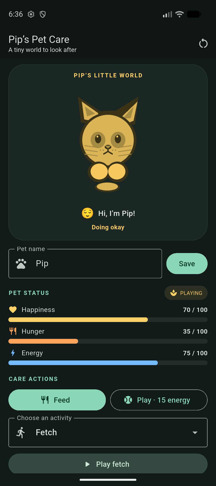
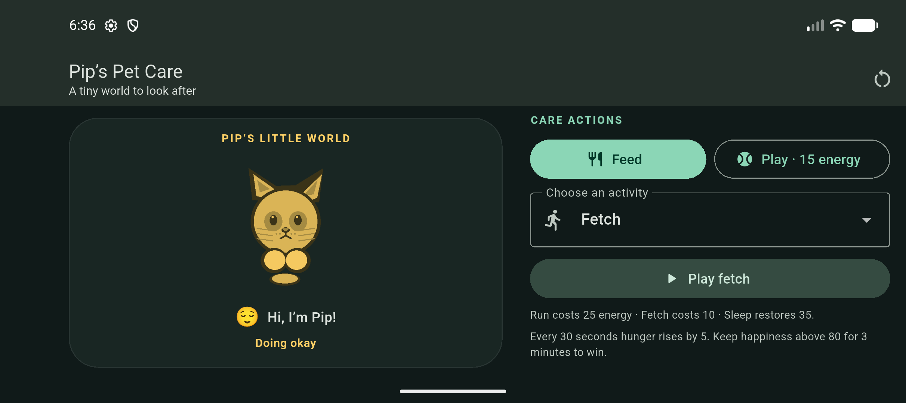

# Digital Pet

In-Class Activity 07 Flutter pet-care game. The app lets you name and care for Pip, shows bounded happiness, hunger, and energy meters, and responds to care actions with mood and motion feedback.

## Student and pathway

- Student: Augustin Kabamba
- Work mode: solo
- Pathway: Graduate
- Repository: [Akabamba24/inclass07_Pet](https://github.com/Akabamba24/inclass07_Pet)
- Graduate features: Energy system, Activity selection, and Visual polish & accessible motion.
- Optional Graduate extension: a lifecycle-owned idle breathing `AnimationController`.

## Features and learning outcomes

| Feature | Behavior and evidence | Learning outcome |
| --- | --- | --- |
| Pet name and status | Enter and confirm a name; happiness, hunger, energy, and text mood are visible. | Stateful input, derived UI, and accessible status feedback. |
| Mood tint | One original grayscale transparent PNG is tinted with `ColorFiltered`/`BlendMode.modulate`; unhappy is red below 30, neutral is yellow from 30–70, and happy is green above 70. | Image composition, threshold boundaries, and non-color mood communication. |
| Feed and play | Feed changes hunger and happiness; play changes happiness, hunger, and energy. Values stay within 0–100. | Atomic state transitions and meter clamping. |
| Timers and outcomes | Hunger rises by 5 every 30 seconds. Happiness must remain above 80 continuously for 3 minutes to win. Loss occurs at hunger 100 and happiness 10 or lower. | Timer lifecycle, terminal-state handling, and boundary testing. |
| Energy system (Graduate) | Play costs 15 energy; Run costs 25; Fetch costs 10; Sleep restores 35. Insufficient energy disables the corresponding action. | Modeling related state and communicating action costs. |
| Activity selection (Graduate) | Choose Run, Fetch, or Sleep; each changes the appropriate meters and requires its documented energy. | Selection-driven events and reusable state rules. |
| Visual polish & accessible motion (Graduate) | Action bounce/reactions, animated meters, expression/message switching, mood tint/scale, and reduced-motion support. | State-driven animation and accessible motion preferences. |
| Idle breathing (Graduate extension) | A gentle `AnimationController` is owned by the pet screen and disposed with it. | Resource ownership and widget lifecycle. |

The Graduate design boundary and one trade-off are documented in [docs/architecture.md](docs/architecture.md). Automated coverage is in `test/pet_game_test.dart` and exercises transitions, clamping, mood thresholds, win cancellation/timing, loss, reset, and timer disposal.

## Care rules

| Action | Happiness | Hunger | Energy |
| --- | ---: | ---: | ---: |
| Feed | +10, unless post-feed hunger is below 30, then −20 | −10 | — |
| Play | +15 | +5 | −15 (requires 15) |
| Run | +20 | +10 | −25 (requires 25) |
| Fetch | +12 | +5 | −10 (requires 10) |
| Sleep | +5 | +5 | +35 |

All meters clamp to 0–100. Hunger reaches 100 without a happiness penalty on the 95→100 tick; each later overflow tick reduces happiness by 20. The mood label is unhappy below 30, neutral from 30 through 70, and happy above 70. A win requires happiness above 80 continuously for three minutes; loss occurs at hunger 100 with happiness 10 or lower.

## Run, test, and build

Requires Flutter and an Android device or emulator.

```sh
flutter pub get
flutter run
flutter test
flutter analyze
flutter build apk --release
```

The release APK is written to `build/app/outputs/flutter-apk/app-release.apk`. For the individual upload, rename the installed-and-verified APK to `DigitalPet_AugustinKabamba.apk` (replace with the course’s required team name if your instructor assigns one).

## Manual verification

Installed release screenshots from the Pixel 10 emulator:

- [Portrait](docs/evidence/pixel10-portrait.png)
- [Portrait care controls](docs/evidence/pixel10-portrait-controls.png)
- [Landscape](docs/evidence/pixel10-landscape.png)
- [Landscape care controls](docs/evidence/pixel10-landscape-controls.png)
- [Feed action](docs/evidence/pixel10-feed-action.png)
- [Play action](docs/evidence/pixel10-play-action.png)
- [Sleep activity and energy recovery](docs/evidence/pixel10-sleep-action.png)
- [Reset action](docs/evidence/pixel10-reset.png)

The emulator screenshots record portrait/landscape layout, Feed (hunger 45→35 and happiness 70→80), Play (happiness 80→95, hunger 35→45, energy 75→60), Sleep (energy recovery), and Reset (meters return to 70/35/75). Automated tests cover exact mood values 29/30/70/71; meter bounds; hunger 95→100→overflow; loss at 100 hunger/10 happiness; canceling the win timer at exactly 80; the 3:00 win; reset timer count; screen cleanup; low-energy gating/recovery; and reduced-motion mode. The widget suite also checks name confirmation and feed UI state. Low-energy gating and reduced-motion behavior were verified in widget tests; reduced motion was not manually toggled on the emulator.

Latest checks: `flutter test` passes all 13 tests, `flutter analyze` reports no issues, and `flutter build apk --release` succeeds. The release build was installed and launched on the Pixel 10 emulator in portrait and landscape.





## Asset license

`assets/pip.png` is an original grayscale transparent illustration generated for this project by `tools/create_pet_asset.py`; it is not copied from a third-party asset pack and requires no external attribution.

## Collaboration evidence and solo limitation

This repository is being completed as an individual project, as stated by the student. The assignment describes a two-team shared-repository workflow and requires a review of a teammate’s pull request. There is no teammate or cross-team pull request in this solo project, so no such review link is claimed here. Repository history is the contribution evidence available for this solo run.

## Individual reflection and submission

The assignment requires each student’s own Word reflection with answers to all ten critical-thinking questions and their name and student ID. The student ID and personal reflection answers must be supplied by the student; they are not fabricated in this repository. Also submit `github_link.txt`, the correctly named release APK, and the individual reflection to the course’s labeled iCollege folder, then verify that the APK launches.
